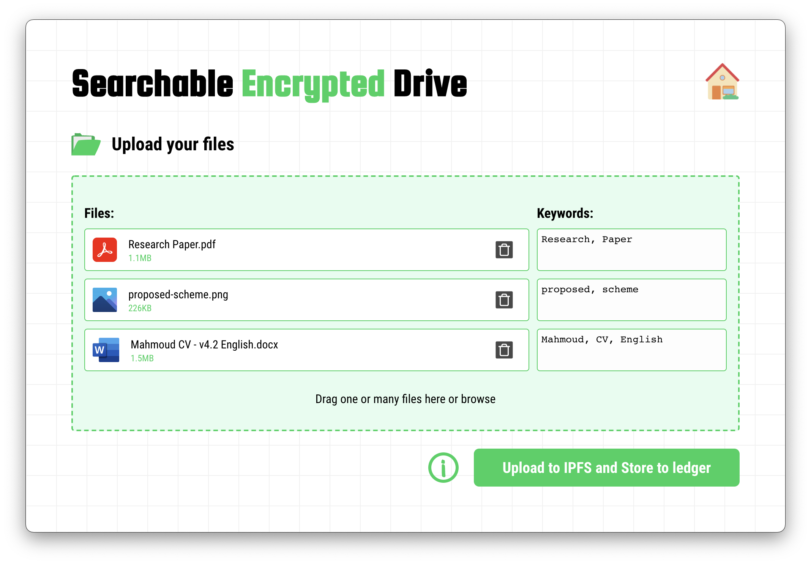

# Searchable Encrypted Drive

SE Drive is an open-source platform that allows its users to store
their notes, files, photos securely and privately on public/private blockchains,
untrusted cloud services, or even on a local disk drive.
State-of-the-art index-based searchable encryption technique is utilized to
ensure every bit of users' data is encrypted the moment it's uploaded, then only the
key-owners can search through this encrypted data without any compromises on security ,privacy, or efficiency. The system is designed such that
any party, involved in the data storage, knows NOTHING about the actual data or the search queries, e.g. peers on a blockchain network, those who
execute the smart contract of the search queries, or cloud service providers.

The current version of the application is build using React with Electron, and optimized to work with Hyperledger Fabric through [this smart contract](https://github.com/MahmoudRe/sse-chaincode) (Chaincode). However, the source-code can be adjusted easily to adopt different blockchain solutions or conventional cloud server.

## Getting started!

To start the electron app with react server, run `npm start`. If something doesn't work well, make sure the two line with `[DEV]` comment in `public/electron.js` are uncommented as follow:

```js
function createWindow(...) {
  ...

  // and load the index.html of the app.
  // win.loadFile("index.html");
  win.loadURL(
      'http://localhost:3000' // [DEV]
      // `file://${path.join(__dirname, '../build/index.html')}`
      + queryString
  );
  
  // [DEV]
  win.webContents.openDevTools({ mode: 'detach' });
}
```

## Make your build!
To build the electron desktop application, the previously mentioned two lines with `[DEV]` comment in `public/electron.js` should be commented, and line under `localhost:3000` should be uncommented as follow:
```js
function createWindow(...) {
  ...

  // and load the index.html of the app.
  // win.loadFile("index.html");
  win.loadURL(
      // 'http://localhost:3000' // [DEV]
      `file://${path.join(__dirname, '../build/index.html')}`
      + queryString
  );
  
  // [DEV]
  // win.webContents.openDevTools({ mode: 'detach' });
}
```

Then run `npm run electron-pack`. For more information about the configuration of the build, please refer to [the documentation of electron-builder](https://www.electron.build/configuration/configuration).

## Demo
Please refer to [this video]() for quick demo of the application.

## Screenshots




